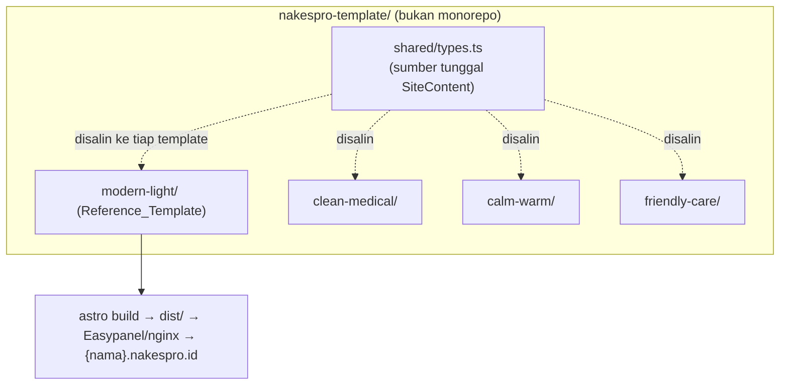
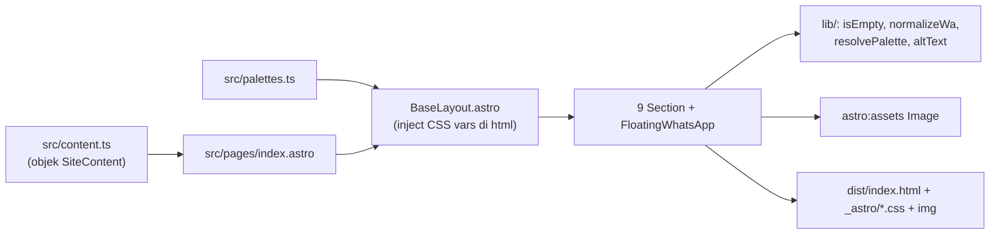

# Dokumen Desain Teknis

## Overview

**NakesPro Landing Templates** adalah repo boilerplate berbasis **Astro v5** yang memproduksi website client statis di `{nama}.nakespro.id` untuk pelanggan Paket Hemat. Repo ini terpisah dari aplikasi Next.js `nakespro-app` dan berisi 4 proyek Astro standalone plus satu folder `shared/`.

Fokus desain ini adalah membangun **`modern-light` sebagai Reference_Template** secara lengkap, sambil mengunci kontrak data `SiteContent` dan pola komponen agar 3 template lain (`clean-medical`, `calm-warm`, `friendly-care`) dapat direplikasi dengan bersih di kemudian hari.

### Keputusan Teknis Kunci

| Keputusan | Pilihan | Alasan |
|-----------|---------|--------|
| Framework | Astro v5 (major saat ini, rilis Des 2024) | Default `output: 'static'`, zero-JS by default, Islands Architecture untuk partial hydration. Cocok untuk hosting massal statis. |
| Output | Static (`output: 'static'`) | Menghasilkan HTML/CSS/aset tanpa Node runtime per-site (R1.5, R10.4). |
| Optimasi gambar | `astro:assets` (`<Image />` / `<Picture />`) | Built-in WebP/AVIF, width/height eksplisit, lazy-loading (R10.8). |
| Interaktivitas | Zero-JS default; `client:visible` hanya bila perlu | Memenuhi NFR performa (R10.1–R10.3). |
| Warna | CSS custom properties di `<html>` dari preset palette | Komponen bebas warna literal, ganti palette tanpa sentuh komponen (R6). |
| Type safety | TypeScript `strict` + `astro check` di pipeline build | Build gagal bila `content.ts` melanggar `SiteContent` (R1.7, R2.12, R8.5). |
| Struktur | 4 proyek standalone, bukan monorepo | Copy 1 folder template + `shared/` → build (R1.8). |

> **Asumsi versi:** Desain mengasumsikan Astro `^5.x`. Default rendering Astro adalah `output: 'static'` (prerender semua route saat build), `astro:assets` menyediakan `<Image />`/`<Picture />`, dan partial hydration memakai direktif `client:*`. Bila versi yang dipakai berbeda, sesuaikan nama integrasi tetapi pola desain tetap berlaku.

### Cakupan

- **In scope sekarang:** kontrak `SiteContent`, struktur repo, sistem palette, komponen 9 section + FloatingWhatsApp, utilitas (WA normalization, empty-detection, palette resolver, alt-text), image handling, alur copy/build/deploy, NFR, dan `modern-light` lengkap dengan konten + foto dummy.
- **Out of scope:** auto-generation (order-id → content.ts), CMS, backend, auth. Alur saat ini manual (R8.6, R13.4).

## Architecture

### Topologi Repo



### Arsitektur Render Satu Template



### Alur Data (single source of truth)

`content.ts` adalah satu-satunya sumber data konten (R13.1). Tidak ada teks/data client yang di-hardcode di komponen. Aliran: `content.ts` (data) + `palettes.ts` (presentasi) → `index.astro` merangkai section terurut → tiap section menerima slice data yang dibutuhkan via props → utilitas memutuskan render/hide → Astro mengeluarkan HTML statis.

### Lapisan Logika

| Lapisan | Tanggung jawab | Pure / Side-effect |
|---------|----------------|--------------------|
| `lib/` (utilitas) | `isEmptyText`, `isEmptyList`, `normalizeWaNumber`, `buildWaUrl`, `resolvePalette`, `resolveAltText` | Pure → kandidat property-based testing |
| Komponen `.astro` | Rendering markup + auto-hide guard | Side-effect (markup) → snapshot/contoh |
| `BaseLayout` | Inject CSS vars, semantic shell, single h1 | Side-effect |
| Build pipeline | `astro check` (typecheck) + `astro build` | Tool eksternal |

## Components and Interfaces

### Struktur Folder Per-Template (standalone)

```
modern-light/
├── package.json              # dependency + script build sendiri (R1.3, R8.1)
├── astro.config.mjs          # output: 'static', integrasi assets
├── tsconfig.json             # strict, extends astro/tsconfigs/strict
├── public/
│   └── images/               # foto client (nakes/ruangan/alat/hasil) (R1.3, R8.2)
└── src/
    ├── types.ts              # SALINAN dari shared/types.ts (R1.6)
    ├── content.ts            # data per-client, bertipe SiteContent (R1.3)
    ├── palettes.ts           # 3-4 Palette_Preset (R1.3, R6.1)
    ├── lib/
    │   ├── empty.ts          # isEmptyText, isEmptyList
    │   ├── whatsapp.ts       # normalizeWaNumber, buildWaUrl
    │   ├── palette.ts        # resolvePalette, paletteToCssVars
    │   └── images.ts         # resolveAltText, resolusi & validasi path foto
    ├── layouts/
    │   └── BaseLayout.astro
    ├── components/
    │   ├── Hero.astro
    │   ├── TrustBar.astro
    │   ├── Services.astro
    │   ├── About.astro
    │   ├── PhotoGallery.astro
    │   ├── HowItWorks.astro
    │   ├── Testimonials.astro
    │   ├── ContactLocation.astro
    │   ├── Footer.astro
    │   └── FloatingWhatsApp.astro
    └── pages/
        └── index.astro
```

`shared/types.ts` adalah sumber kanonik; `src/types.ts` tiap template adalah salinannya. Konsistensi salinan diuji (lihat Testing Strategy) sehingga drift terdeteksi (R1.6, R1.7).

### Komponen Halaman: `index.astro`

Merangkai kesembilan section pada urutan tetap 1–9 plus FloatingWhatsApp (R3.2). Setiap section menerima hanya slice `SiteContent` yang relevan.

```astro
---
import content from '../content.ts';
import BaseLayout from '../layouts/BaseLayout.astro';
import Hero from '../components/Hero.astro';
// ...impor section lain
---
<BaseLayout content={content}>
  <Hero content={content} />            <!-- 1, selalu render -->
  <TrustBar items={content.credentials} />     <!-- 2 -->
  <Services items={content.services} />         <!-- 3 -->
  <About text={content.about} />                <!-- 4 -->
  <PhotoGallery photos={content.photos} />      <!-- 5 -->
  <HowItWorks steps={content.howItWorks} />     <!-- 6 -->
  <Testimonials items={content.testimonials} /> <!-- 7 -->
  <ContactLocation
    practiceHours={content.practiceHours}
    location={content.location}
    googleMaps={content.googleMaps} />          <!-- 8 -->
  <Footer />                                    <!-- 9, selalu render -->
  <FloatingWhatsApp waNumber={content.waNumber} waMessage={content.waMessage} />
</BaseLayout>
```

### Interface Tiap Komponen & Aturan Auto-Hide

| Komponen | Props dari SiteContent | Aturan render | Auto-hide? |
|----------|------------------------|---------------|------------|
| `Hero` | `content` (websiteName, tagline, photos.nakes[0], serviceType) | Selalu render; tampilkan foto nakes + WA CTA above-the-fold (≥640px) | Tidak (R5.5) |
| `TrustBar` | `credentials[]` | Render bila list tidak kosong | Ya (R3.5, R3.12) |
| `Services` | `services[]` | Render bila list tidak kosong | Ya |
| `About` | `about?: string` | Render bila teks tidak kosong | Ya |
| `PhotoGallery` | `photos {nakes,ruangan,alat,hasil}` | Render section bila ada ≥1 foto di kategori mana pun; sembunyikan grup kategori kosong | Ya per kategori (R3.13) |
| `HowItWorks` | `howItWorks[]` | Render bila list tidak kosong | Ya |
| `Testimonials` | `testimonials[]` | Render bila list tidak kosong | Ya |
| `ContactLocation` | `practiceHours?`, `location?`, `googleMaps?` | Render section bila ≥1 sub-field tidak kosong; render hanya sub-field tidak kosong (partial); bila `googleMaps` kosong tampilkan indikasi peta tak tersedia | Ya penuh + partial (R3.11, R3.14, R5.6) |
| `Footer` | — | Selalu render "Powered by NakesPro" | Tidak (R5.5, R3.15) |
| `FloatingWhatsApp` | `waNumber`, `waMessage?` | Render bila nomor valid (8–15 digit setelah normalisasi); sticky 320–1920px | Ya bila invalid (R4.4) |

Pola auto-hide diimplementasikan dengan guard di awal template komponen:

```astro
---
import { isEmptyList } from '../lib/empty.ts';
const { items } = Astro.props;
if (isEmptyList(items)) return null; // tidak emit elemen/heading/container (R5.3)
---
<section aria-labelledby="services-h"> ... </section>
```

### BaseLayout & Injeksi Palette

`BaseLayout.astro` menyusun shell semantik (`<html lang="id">`, single `<h1>` ada di Hero), meng-inject CSS custom properties hasil `resolvePalette`, dan menempatkan `<slot />`.

```astro
---
import palettes, { DEFAULT_PALETTE_ID } from '../palettes.ts';
import { resolvePalette, paletteToCssVars } from '../lib/palette.ts';
const { content } = Astro.props;
const palette = resolvePalette(palettes, content.palette, DEFAULT_PALETTE_ID);
const cssVars = paletteToCssVars(palette); // "--accent:#..;--background:#.." dst
---
<html lang="id" style={cssVars}>
  <head>…meta, font preconnect…</head>
  <body><slot /></body>
</html>
```

## Data Models

### Tipe `SiteContent` (shared/types.ts)

```typescript
// shared/types.ts — sumber kanonik; disalin ke tiap template sebagai src/types.ts
export type TemplateId =
  | 'modern-light' | 'clean-medical' | 'calm-warm' | 'friendly-care';

export type ServiceType = 'nakes' | 'homecare' | 'both';

export interface Photo {
  url: string;        // tidak kosong; nama berkas di public/images/ (R2.6)
  caption?: string;   // dipakai sebagai alt bila ada (R11.1)
}

export interface PhotoSet {
  nakes: Photo[];     // 0–20
  ruangan: Photo[];   // 0–20
  alat: Photo[];      // 0–20
  hasil: Photo[];     // 0–20
}

export interface Credential { label: string; icon: string; }              // 0–12
export interface Service { title: string; description: string; icon?: string; } // 0–12
export interface HowItWorksStep { step: number; title: string; description: string; } // 0–10; step bil. bulat positif
export interface Testimonial { name: string; text: string; role?: string; } // 0–20

export interface SiteContent {
  // — Presentasi (wajib) —
  template: TemplateId;                 // R2.1
  palette: string;                      // id preset template terpilih (R2.2)

  // — Turunan Order_Model (wajib) —
  websiteName: string;                  // 1–100 char (R2.3)
  description: string;                  // 1–500 char (R2.3)
  serviceType: ServiceType;             // R2.4
  waNumber: string;                     // hanya digit (R2.4)

  // — Turunan Order_Model (opsional, memicu Auto-Hide) —
  practiceHours?: string;               // 0–200 (R2.5)
  location?: string;                    // 0–200 (R2.5)
  googleMaps?: string;                  // 0–1000 (R2.5)
  photos?: PhotoSet;                    // R2.6, R2.13

  // — Konten (opsional, memicu Auto-Hide) —
  tagline?: string;                     // 0–160 (R2.7)
  about?: string;                       // 0–2000 (R2.7)
  credentials?: Credential[];           // R2.8
  services?: Service[];                 // R2.9
  howItWorks?: HowItWorksStep[];        // R2.10
  testimonials?: Testimonial[];         // R2.11

  // — CTA WhatsApp (opsional) —
  waMessage?: string;                   // pesan prefilled, dipotong di 1000 char (R4.3)
}
```

> **Rekonsiliasi `waMessage`:** Requirement 4.3 mereferensikan pesan prefilled namun `waMessage` belum disebut eksplisit di daftar field R2. Desain ini menambahkan `waMessage?: string` ke kontrak `SiteContent`. Karena field ini belum dikumpulkan oleh form `nakespro-app`, ia ditandai sebagai data yang nantinya dikumpulkan form dan untuk sekarang diisi manual dari chat WhatsApp (R2.15).

### Penegakan Kontrak Saat Build

Batas panjang/kardinalitas (mis. 1–100 char, 0–20 entri) tidak semuanya dapat dipaksakan murni oleh tipe TypeScript. Strategi dua lapis:

1. **Type-level (wajib & enum):** `template`, `palette`, `websiteName`, `description`, `serviceType`, `waNumber` adalah field non-optional. Bila hilang/tipe salah, `astro check` (tsc) gagal sebelum output (R2.12, R8.5). Enum `TemplateId`/`ServiceType` mencegah nilai di luar himpunan (R2.1, R2.4).
2. **Runtime guard saat build (bounds):** modul `content.ts` memanggil `assertSiteContent(content)` (validator ringan, mis. berbasis cek manual atau skema Zod opsional) yang melempar error pada pelanggaran bound (panjang string, jumlah entri, `step` bilangan bulat positif, `url` tidak kosong). Karena `index.astro` mengimpor `content.ts`, error ini menghentikan `astro build` sebelum `dist/` dihasilkan.

> Catatan: pemilihan validator runtime (manual vs Zod) adalah detail implementasi; desain mensyaratkan build gagal pada input invalid, bukan pustaka tertentu.

### Pemetaan Order_Model → SiteContent (R13.2)

Pemetaan satu-ke-satu, dapat disalin langsung tanpa merge/split/drop:

| Order / OrderPhoto field | SiteContent field |
|--------------------------|-------------------|
| `Order.websiteName` | `websiteName` |
| `Order.description` | `description` |
| `Order.serviceType` | `serviceType` |
| `Order.waNumber` | `waNumber` |
| `Order.practiceHours` | `practiceHours` |
| `Order.location` | `location` |
| `Order.googleMaps` | `googleMaps` |
| `OrderPhoto{category,url,caption}` | `photos[category][] = {url, caption}` |
| `Order.templateId` | `template` |
| — (belum di Order) | `palette`, `tagline`, `about`, `credentials`, `services`, `howItWorks`, `testimonials`, `waMessage` → manual sekarang (R2.15) |

### Model Palette (palettes.ts)

```typescript
// src/palettes.ts (per-template)
export interface PaletteTokens {
  accent: string;       // warna aksi/CTA
  background: string;   // latar halaman
  surface: string;      // latar kartu/section
  text: string;         // teks utama
  muted: string;        // teks sekunder
}
export interface Palette { id: string; name: string; tokens: PaletteTokens; }

// modern-light: 3–4 preset netral, semua AA-compliant (R6.1, R6.8)
const palettes: Palette[] = [
  { id: 'neutral',  name: 'Netral',  tokens: { accent:'#2563eb', background:'#ffffff', surface:'#f8fafc', text:'#0f172a', muted:'#475569' } },
  { id: 'slate',    name: 'Slate',   tokens: { /* … AA … */ } },
  { id: 'graphite', name: 'Graphite',tokens: { /* … AA … */ } },
];
export const DEFAULT_PALETTE_ID = 'neutral'; // tepat satu default (R6.6)
export default palettes;
```

Setiap preset wajib mendefinisikan himpunan token yang sama minimal `accent, background, surface, text, muted` (R6.2). Token dirancang memenuhi WCAG AA (≥4.5:1 teks vs background/surface; ≥3:1 teks besar & accent pada UI) — diverifikasi di Testing Strategy (R6.8, R11.3).

## Correctness Properties

*Sebuah property adalah karakteristik atau perilaku yang harus selalu benar di seluruh eksekusi valid dari sistem — pernyataan formal tentang apa yang seharusnya dilakukan sistem. Property menjadi jembatan antara spesifikasi yang dapat dibaca manusia dan jaminan kebenaran yang dapat diverifikasi mesin.*

Sebagian besar repo ini adalah situs statis Astro (rendering UI, IaC-like config, CSS) yang **bukan** kandidat property-based testing dan lebih tepat diuji dengan snapshot/integration/audit (lihat Testing Strategy). Namun terdapat lapisan **utilitas murni** (`lib/`) dan beberapa **invarian struktur output** yang sangat cocok untuk PBT. Property berikut menargetkan lapisan tersebut.

### Property 1: Normalisasi nomor WhatsApp menjadi digit & kode negara

*Untuk setiap* string nomor masukan (mengandung `+`, `-`, spasi, tanda kurung, atau angka 0 di depan), hasil `normalizeWaNumber` hanya berisi karakter digit, tidak mengandung simbol non-digit, dan bila masukan (setelah dibersihkan) diawali `0` maka `0` di depan diganti dengan `62`.

**Validates: Requirements 4.2, 3.4**

### Property 2: Validitas nomor menentukan kemunculan WhatsApp CTA

*Untuk setiap* string `waNumber`, FloatingWhatsApp dirender jika dan hanya jika jumlah digit hasil normalisasi berada di rentang 8 sampai 15 inklusif; di luar itu (termasuk kosong/undefined) CTA tidak dirender.

**Validates: Requirements 4.4**

### Property 3: Pesan prefill WhatsApp dipotong di 1000 karakter

*Untuk setiap* string `waMessage`, hasil yang disertakan pada URL `wa.me` memiliki panjang maksimal 1000 karakter dan merupakan prefix dari masukan asli (tidak ada karakter yang ditambahkan atau diubah, hanya dipotong).

**Validates: Requirements 4.3**

### Property 4: Deteksi "kosong" sesuai definisi kontrak

*Untuk setiap* nilai field, `isEmptyText` mengembalikan true tepat ketika nilai adalah undefined, null, atau string yang hanya berisi whitespace; dan `isEmptyList` mengembalikan true tepat ketika nilai adalah undefined, null, atau daftar dengan 0 entri.

**Validates: Requirements 5.2**

### Property 5: Auto-hide section — render jika dan hanya jika data tidak kosong

*Untuk setiap* `SiteContent` yang dihasilkan, setiap section auto-hide (TrustBar, Services, About, PhotoGallery, HowItWorks, Testimonials, ContactLocation) menghasilkan elemen/heading/container pada output jika dan hanya jika data pendukungnya tidak kosong (per Property 4); section yang datanya kosong tidak menyisakan elemen apa pun. Untuk PhotoGallery, hanya grup kategori yang tidak kosong yang dirender; untuk ContactLocation, hanya sub-field yang tidak kosong yang dirender dan section hilang penuh hanya bila semua sub-field kosong.

**Validates: Requirements 3.12, 3.13, 3.14, 5.3, 5.4, 5.6, 7.6, 2.13**

### Property 6: Urutan section relatif selalu terjaga

*Untuk setiap* `SiteContent`, urutan kemunculan section yang dirender pada output build mengikuti urutan relatif 1–9 (Hero, TrustBar, Services, About, PhotoGallery, HowItWorks, Testimonials, ContactLocation, Footer) tanpa ada section yang tampil di luar urutan, terlepas dari section mana yang ter-auto-hide.

**Validates: Requirements 3.2, 5.7**

### Property 7: Hero dan Footer selalu dirender

*Untuk setiap* `SiteContent` valid (termasuk yang seluruh field opsionalnya kosong), output build selalu memuat section Hero dan section Footer; keduanya tidak pernah ter-auto-hide.

**Validates: Requirements 5.5, 3.15**

### Property 8: Render menampilkan seluruh entri data yang tidak kosong

*Untuk setiap* daftar data tidak kosong (`credentials`, `services`, `howItWorks`, `testimonials`) dan setiap kategori foto tidak kosong, output section terkait memuat representasi setiap entri pada daftar tersebut (tidak ada entri yang hilang).

**Validates: Requirements 3.5, 3.6, 3.7, 3.8, 3.9, 3.10, 3.11**

### Property 9: Resolusi palette — preset valid atau fallback default dengan peringatan

*Untuk setiap* nilai `palette`, `resolvePalette` mengembalikan preset yang id-nya cocok bila id dikenal; bila id tidak dikenal atau kosong, fungsi mengembalikan preset default dan menandai peringatan yang memuat id yang tidak dikenal, tanpa menghentikan proses.

**Validates: Requirements 6.5, 6.7**

### Property 10: Semua preset palette mendefinisikan himpunan token yang sama

*Untuk setiap* Palette_Preset pada `palettes.ts`, himpunan kunci token sama persis dan minimal memuat `accent`, `background`, `surface`, `text`, dan `muted`.

**Validates: Requirements 6.2**

### Property 11: Setiap preset memenuhi kontras WCAG AA

*Untuk setiap* Palette_Preset, rasio kontras `text` terhadap `background` dan terhadap `surface` minimal 4.5:1, dan rasio kontras `accent` (saat dipakai pada elemen UI) terhadap latarnya minimal 3:1.

**Validates: Requirements 6.8, 11.3**

### Property 12: Teks alternatif gambar selalu bermakna

*Untuk setiap* `Photo`, `resolveAltText` mengembalikan `caption` bila tidak kosong; bila kosong, mengembalikan teks alternatif default deskriptif yang tidak kosong sepanjang 1 sampai 125 karakter.

**Validates: Requirements 11.1**

### Property 13: Tepat satu h1 dan struktur heading tidak melompat

*Untuk setiap* `SiteContent` yang dihasilkan, output build memuat tepat satu elemen `h1`, dan urutan level heading dalam dokumen tidak pernah melompati level (mis. h2 tidak langsung diikuti h4).

**Validates: Requirements 11.2**

### Property 14: Atribut gambar memenuhi kontrak performa

*Untuk setiap* gambar yang dirender, markup memuat atribut `width` dan `height` eksplisit, gambar below-the-fold memakai `loading="lazy"`, dan sumber gambar dalam format modern (WebP/AVIF).

**Validates: Requirements 10.8**

### Property 15: Validator bounds menerima konten valid dan menolak pelanggaran

*Untuk setiap* `SiteContent` yang seluruh field-nya berada dalam batas kontrak (panjang string, kardinalitas daftar, `step` bilangan bulat positif, `url` tidak kosong), `assertSiteContent` lolos tanpa error; dan *untuk setiap* konten yang melanggar tepat satu batas, `assertSiteContent` melempar error yang menyebut field yang melanggar.

**Validates: Requirements 2.3, 2.5, 2.6, 2.7, 2.8, 2.9, 2.10, 2.11, 2.12**

### Property 16: Identitas data lintas template

*Untuk setiap* `content.ts` valid, membaca seluruh nilai field `SiteContent` menghasilkan nilai yang sama persis terlepas dari `template` yang dipilih (mengganti template tidak mengubah, menghilangkan, atau menambah nilai field apa pun).

**Validates: Requirements 7.7, 2.14, 13.3**

## Error Handling

### Kesalahan Waktu Build (build-time, fail-fast)

| Kondisi | Penanganan | Requirement |
|---------|-----------|-------------|
| Field wajib hilang / tipe salah / nilai enum di luar himpunan | `astro check` (tsc) gagal sebelum `dist/` dibuat; pesan menyebut field | R1.7, R2.12, R8.5 |
| Pelanggaran bound (panjang/kardinalitas/`step`/`url` kosong) | `assertSiteContent` melempar error saat impor `content.ts` → `astro build` berhenti sebelum output; pesan menyebut field | R2.12, R8.5 |
| `dist/` lama saat build gagal | Build menulis ke folder sementara dan hanya menukar ke `dist/` saat sukses, sehingga `dist/` yang sudah ada tidak dimodifikasi saat build gagal | R8.5 |
| Salinan `SiteContent` drift dari `shared/types.ts` | Test konsistensi tipe gagal di CI | R1.6, R1.7 |

### Kebijakan Foto Hilang — Dua Mode

Requirement memuat dua perilaku berbeda; desain memisahkannya secara eksplisit:

- **Mode STRICT (produksi client, R8.7):** bila `content.ts` mereferensikan foto yang tidak ada di `public/images/`, `astro:assets`/loader gambar gagal saat build dan `astro build` berhenti sebelum output, menampilkan nama berkas yang hilang. Ini default untuk build client.
- **Mode PLACEHOLDER (Reference_Template, R9.7):** `modern-light` dapat menyalakan flag (mis. `ALLOW_PLACEHOLDER=1`) sehingga foto hilang diganti gambar placeholder dan rendering section lain tetap berlanjut. Mode ini hanya untuk pengembangan referensi, bukan build client.

> Default Astro `astro:assets` untuk gambar lokal adalah gagal pada path tak ditemukan; mode placeholder diimplementasikan dengan resolusi path bersyarat di `lib/images.ts`.

### Penanganan Runtime (di dalam halaman statis)

| Kondisi | Penanganan | Requirement |
|---------|-----------|-------------|
| `palette` tak dikenal/kosong | Fallback ke preset default + log peringatan (console saat build), rendering lanjut | R6.7 |
| `waNumber` invalid (kosong / <8 / >15 digit) | FloatingWhatsApp tidak dirender (graceful) | R4.4 |
| `waMessage` > 1000 char | Dipotong di 1000 char | R4.3 |
| `googleMaps` kosong tetapi sub-field Contact lain ada | Section Contact tetap render dengan indikasi peta tidak tersedia | R3.14 |
| `caption` foto kosong | Pakai alt-text default deskriptif | R11.1 |

### Kesalahan Deployment (di luar Build_Process)

Deployment menukar `dist/` secara atomik di nginx (symlink/rename). Bila deploy gagal, versi statis sebelumnya tetap tersaji dan kegagalan ditandai ke Maintainer (log/notifikasi ops). Ini proses operasional di luar repo template (R8.8) dan diuji secara manual/ops.

## Testing Strategy

Pendekatan berlapis sesuai sifat tiap bagian sistem.

### 1. Property-Based Tests (lapisan utilitas murni & invarian output)

- Pustaka: **fast-check** (TypeScript), dijalankan via Vitest. PBT tidak diimplementasikan dari nol.
- Setiap property dari bagian Correctness Properties diimplementasikan oleh **satu** property-based test.
- Minimal **100 iterasi** per property test.
- Setiap test diberi tag komentar dengan format: `Feature: nakespro-landing-templates, Property {n}: {teks property}`.
- Untuk property yang menyentuh output render (Property 5, 6, 7, 8, 13, 14), test merender komponen/halaman dengan input `SiteContent` yang di-generate (memakai `astro:container` API atau render-to-string) lalu memeriksa struktur HTML hasil.
- Untuk property utilitas (Property 1, 2, 3, 4, 9, 10, 11, 12, 15, 16) test memanggil fungsi `lib/` secara langsung.

Generator kunci:
- `arbWaNumber`: string nomor dengan sisipan `+ - ( ) spasi` dan variasi leading `0`/`62`.
- `arbSiteContent`: `SiteContent` acak dengan tiap field opsional bisa kosong/terisi (termasuk string whitespace, list 0–N entri, kategori foto sebagian kosong) — sekaligus menumbuhkan edge case R7.x.
- `arbBounds`: konten dalam-batas dan konten yang melanggar tepat satu batas untuk Property 15.

### 2. Unit / Example Tests

- Footer memuat "Powered by NakesPro" (R3.15).
- `DEFAULT_PALETTE_ID` menunjuk satu preset valid; jumlah preset 3–4 dengan id unik (R6.1, R6.6).
- Hero memuat foto nakes + WA CTA di markup (R3.3); accessible name WA CTA tidak kosong (R11.4); iframe Maps punya `title` (R11.6).
- Skenario foto hilang mode STRICT (R8.7) dan mode PLACEHOLDER (R9.7).

### 3. Konsistensi Kontrak & Struktur (smoke/static)

- Bandingkan `src/types.ts` tiap template dengan `shared/types.ts` (R1.6, R1.7).
- Verifikasi 4 folder template dengan id benar & 5 artefak wajib tiap template; laporkan yang hilang (R1.2, R1.3, R1.4).
- Static check: komponen tidak memuat warna literal (hanya CSS var) (R6.4) dan tidak ada konten client di-hardcode (R13.1); tidak ada `lorem/TODO/TBD` di `modern-light` (R9.3).

### 4. Integration / Build Tests

- Copy folder template + `shared/` ke lokasi terisolasi, `astro build`, verifikasi `dist/` berisi statis tanpa server entry (R1.5, R1.8, R8.1, R8.3, R10.4).
- Build `modern-light` dengan konten dummy penuh: 9 section render tanpa error untuk setiap preset (R9.1, R9.2, R9.4).
- Type-failure build menghasilkan exit non-zero, menyebut field, dan tidak menyentuh `dist/` lama (R8.5).

### 5. Performa, Aksesibilitas, Responsivitas (audit/gate)

- **Lighthouse CI** profil mobile (CPU 4x, Slow 4G): Performance ≥90; LCP ≤2.5s, CLS ≤0.1, INP ≤200ms; transfer awal ≤500KB; JS terkompresi ≤50KB/halaman. Budget gate gagal dengan metrik dilanggar (R10.3, R10.5, R10.6, R10.7, R10.9).
- Verifikasi zero-JS untuk halaman tanpa island (R10.1, R10.2).
- **axe-core** untuk a11y: heading order, alt text, accessible names, kontras, fokus terlihat, touch target (R11.2, R11.4–R11.7); kontras preset juga divalidasi oleh Property 11.
- Uji viewport sampel (320/375/768/1024/1920) tanpa horizontal scroll; breakpoint mobile/tablet/desktop; gallery & maps responsif (R12.1–R12.6).

> **Catatan PBT:** Lighthouse/CWV, deployment, zero-JS measurement, dan layout responsif **tidak** memakai PBT karena menguji infrastruktur/metrik eksternal yang tidak bervariasi meaningful dengan input acak — gunakan integration test/audit dengan 1–beberapa contoh sesuai panduan.

## Requirements Traceability

| Requirement | Elemen Desain yang Memenuhi |
|-------------|------------------------------|
| 1.1–1.4 | Struktur Folder Per-Template; `shared/types.ts`; smoke struktur (Testing §3) |
| 1.5 | `astro.config.mjs` `output:'static'`; integration build (§4) |
| 1.6, 1.7 | Salinan `src/types.ts`; Penegakan Kontrak; test konsistensi tipe (§3); Error Handling build-time |
| 1.8 | Topologi Repo (standalone, non-monorepo); integration copy-build (§4) |
| 2.1–2.11 | Tipe `SiteContent`; validator bounds; Property 15 |
| 2.12 | Penegakan Kontrak Saat Build; Error Handling; Property 15 |
| 2.13 | `SiteContent` field opsional; Property 5 |
| 2.14, 13.3 | Salinan kanonik `shared/types.ts`; Property 16; test konsistensi |
| 2.15 | Catatan rekonsiliasi `waMessage` & field manual |
| 3.1, 3.16 | Komponen 9 section; index.astro; smoke (§3) |
| 3.2, 5.7 | `index.astro` urutan tetap; Property 6 |
| 3.3, 3.4 | `Hero.astro` + WA CTA; unit test (§2); Property 1 |
| 3.5–3.11 | Interface komponen section; Property 8 |
| 3.12, 3.13, 3.14 | Pola Auto-Hide; `lib/empty.ts`; Property 5 |
| 3.15 | `Footer.astro`; unit test (§2); Property 7 |
| 4.1 | `FloatingWhatsApp.astro` sticky; example/responsif (§5) |
| 4.2 | `lib/whatsapp.ts normalizeWaNumber`; Property 1 |
| 4.3 | `buildWaUrl` truncation; Property 3 |
| 4.4 | Aturan validitas digit; Property 2 |
| 5.1 | `index.astro` impor semua section; smoke (§3) |
| 5.2 | `lib/empty.ts`; Property 4 |
| 5.3, 5.4 | Guard auto-hide; Property 5 |
| 5.5 | Hero/Footer dikecualikan auto-hide; Property 7 |
| 5.6 | `ContactLocation` partial render; Property 5 |
| 6.1, 6.6 | `palettes.ts` 3–4 preset + DEFAULT; unit test (§2) |
| 6.2 | Model Palette token set; Property 10 |
| 6.3 | `BaseLayout` injeksi CSS vars di `<html>`; example (§2) |
| 6.4 | Komponen pakai CSS var; static check (§3) |
| 6.5, 6.7 | `lib/palette.ts resolvePalette`; Property 9; Error Handling runtime |
| 6.8, 11.3 | Token preset AA; Property 11; axe (§5) |
| 7.1–7.4 | Karakter visual per-template (modern-light dulu); smoke build (§5) |
| 7.5 | Kontrak identik; Property 16 |
| 7.6 | Pola auto-hide bersama; Property 5 |
| 7.7 | Identitas data; Property 16 |
| 8.1, 8.3 | Standalone folder; integration build (§4) |
| 8.2, 8.6, 13.4 | Alur copy/build/deploy manual; Out of scope auto-gen |
| 8.4, 8.8 | Deployment Easypanel/nginx atomik; ops/manual (Error Handling) |
| 8.5 | Build fail-fast + dist atomik; Property 15; Error Handling |
| 8.7 | Mode STRICT foto hilang; unit test (§2) |
| 9.1–9.6, 9.8 | Reference_Template `modern-light`; konten/foto dummy; integration (§4) |
| 9.7 | Mode PLACEHOLDER; unit test (§2); Error Handling |
| 10.1–10.4 | `output:'static'` zero-JS, partial hydration `client:visible`; integration (§4/§5) |
| 10.5–10.7, 10.9 | Lighthouse CI budget gate (§5) |
| 10.8 | `astro:assets <Image/>`; Property 14 |
| 11.1 | `lib/images.ts resolveAltText`; Property 12 |
| 11.2 | Semantic shell `BaseLayout`; Property 13 |
| 11.4 | Accessible name WA CTA; unit test (§2) |
| 11.5, 11.7 | Fokus terlihat & touch target; axe (§5) |
| 11.6 | `title` iframe Maps; unit test (§2) |
| 12.1–12.6 | Strategi responsif mobile-first; breakpoint; audit (§5) |
| 13.1 | `content.ts` single source; static check (§3) |
| 13.2 | Tabel pemetaan Order→SiteContent |

## Phase Completion

Desain ini fokus membangun `modern-light` sekarang sambil mengunci kontrak `SiteContent`, sistem palette, pola auto-hide, dan utilitas murni agar 3 template lain direplikasi bersih. Bila ditemukan celah pada requirements (mis. detail mode placeholder vs strict, atau field `waMessage`), saya dapat kembali ke fase klarifikasi requirements.
